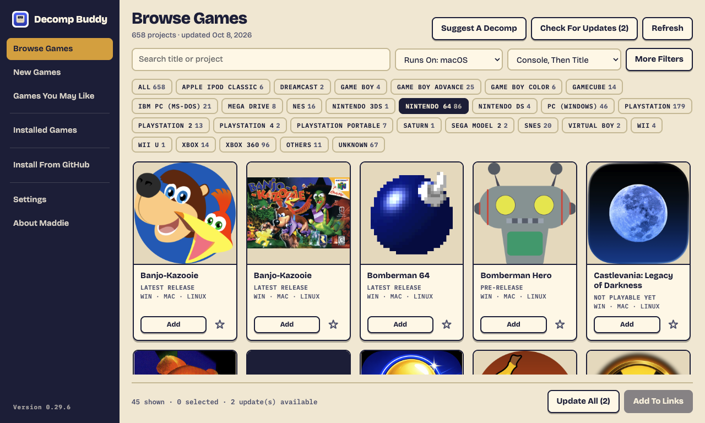
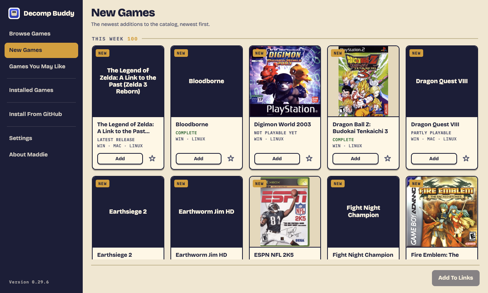
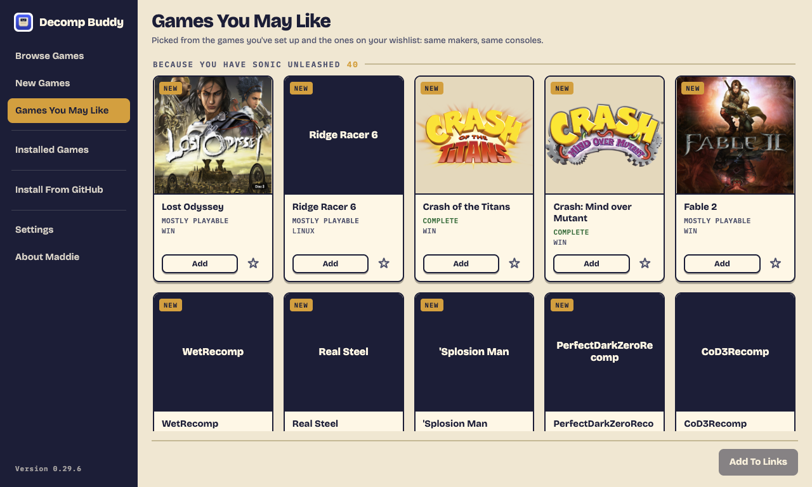
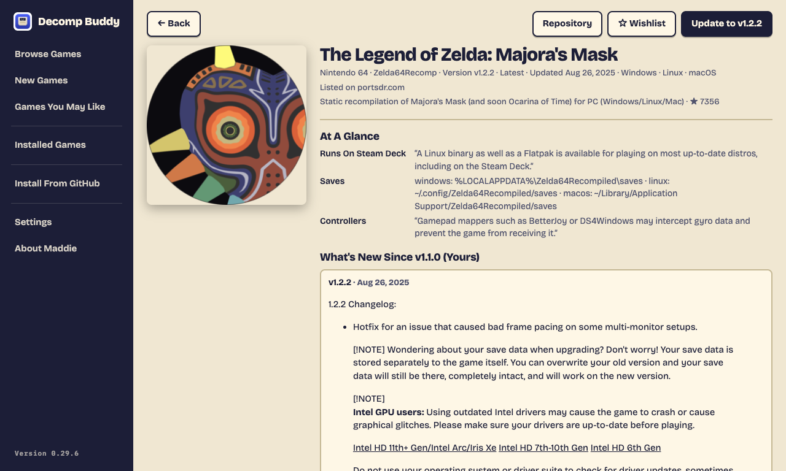
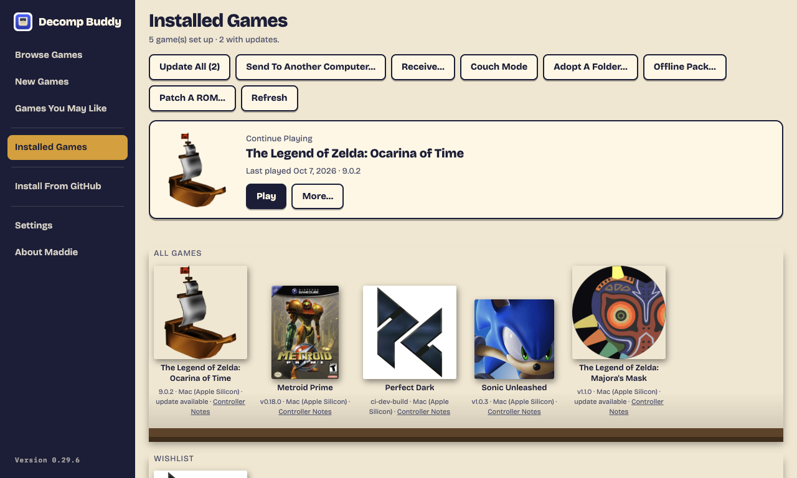
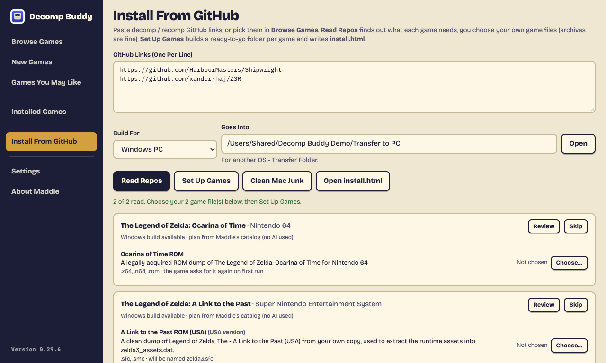

# Decomp Buddy

[](https://decompbuddy.com/games)
[](https://decompbuddy.com/download)
[](LICENSE)


**Every game decompilation, recompilation and native PC port in one place - and each one as close to a one-click install as we can make it.**

Get it at **[decompbuddy.com](https://decompbuddy.com)**. Free, no account, no ads. Made by Maddie at [Tanooki Studios](https://tanookistudios.com).



## What we're trying to do

The decomp scene is turning classic console games into real programs that run natively on a modern computer - Ship of Harkinian, Zelda 64: Recompiled, Unleashed Recompiled, Perfect Dark, Metroid Prime and hundreds more. But every project installs differently: its own release files, its own folder rules, its own idea of which disc image you need and where it goes. Most people give up at the README.

Decomp Buddy wants to be **the definitive source for all of it**: one catalog of every decomp and port worth playing, and a setup that turns each one into a single click plus your own game file.

- **One catalog.** 658 games today (the badge above is live), merged from portsdr.com, community lists and hand-found projects, checked by hand so only games you can actually play are listed. Decomps that only rebuild the original cartridge wait on a separate list and join the catalog on their own the day they ship a PC version.
- **Generative AI reads the instructions so you don't have to.** For every project, an AI reads its GitHub page - README, docs, every release - and turns it into a precise install plan: which download fits your computer, which game file it needs (with the checksum the project publishes), the exact folder it goes in, and how to start it. Those plans are written ahead of time for every game in the catalog, so installing one needs no AI key at all - you just pick your game file.
- **Any GitHub link works too.** Found a project that isn't in the catalog yet? Paste its link into **Install From GitHub**. With your own AI key (Claude, any OpenAI-compatible service, or a free local model through Ollama) Decomp Buddy reads that repository the same way and sets it up.
- **Kept up to date for you.** Once a game is installed, Decomp Buddy watches its project for new releases. When one lands, the game is marked, you see what changed, and **Update** (or **Update All**) installs it with your game files carried over and your saves backed up first.
- **Your games, your files.** Decomp Buddy never downloads a game. You bring a copy you own; it checks it's the one the project needs.

## Screenshots

| | |
|---|---|
|  **New Games** - the newest additions, by week. |  **Games You May Like** - picked from what you've installed. |
|  **A game's page** - facts read from the project's own docs, and what changed since your version. |  **Installed Games** - play, update, back up saves, add to Steam. |
|  **Install From GitHub** - paste any link; catalog games use their published plan, no AI needed. |  **Browse Games** - every console, one button each. |

Screenshots are taken by `scripts/screenshots.sh` from the real app, hidden, on made-up demo data.

## Use

```bash
npm install
npm start
```

1. Settings → pick your AI provider, paste your key → Save (stored encrypted via the OS keychain) → **Load Models** → pick one.
2. Paste links, one per line. **Read Repos** — Claude works out the game, the console, and which game files it needs.
3. **Choose…** each game file from your own legal copy. Picked files are moved into the game folder (Settings → untick to copy instead).
4. **Set Up Games**. Open `install.html`: placed files show **In Place**; anything you skipped shows **Still Needed** with the exact folder.
5. Mac only: hit **Clean Mac Junk** right before copying to the PC (Finder recreates `.DS_Store` when you browse the folders).

Pick a `.zip`, `.7z`, `.rar`, `.tar.gz` (or bz2/xz/cab) instead of the ROM and it's unpacked for you: the game file inside is found (exact expected name first, then the accepted formats, `.cue` over `.bin`, else the biggest file), verified, and moved into place. Unpacking happens in a staging folder on the same drive as the output so the final move is instant; your original archive is left where it was.

A repo that ships several games (e.g. OpenSpideyPS1: Spider-Man and Spider-Man 2) gets a folder per game. Picking a `.cue` brings its `.bin` tracks along.

Games that take the ISO through their own first-run picker (skate3recomp, strikers, goldenballoon) get it staged in `Game Files/` — one click in the game's own UI on the PC and you're done.

Per game you get:

- the extracted Windows release, or `Source/` + `BUILD ON PC.txt` when the project publishes no Windows build
- a drop folder per required game file, each with a `PUT GAME FILE HERE.txt`
- `decomp-buddy.json` — the plan; `install.html` is regenerated from these every run, so it always lists every game ever set up

## Browse Games

**Browse Games** shows two catalogs merged inside the app - [portsdr.com](https://portsdr.com/) and [Alexbeav's PS1 recomps](https://alexbeav.github.io/psxrecomp-ports/) - deduplicated by repository, so the same project never appears twice while different people's ports of the same game all stay listed. Alexbeav's entries carry region, disc serial, BIOS model and disc count, which feed straight into verification. It shows every decomp/recomp - every decomp/recomp it lists, grouped by original console, with the project's icon, release version, status (Latest / Pre-release), last update, and which platforms it builds for. Search, filter by console or status, "Windows only" (on by default), "Installed only".

Each game is a tile: its box art, title, how complete it is and which computers it runs on, an **Add** button and the wishlist star - everything else (version, where it's listed, other ports, disc details) is on its page. Console buttons (as many rows as they need) show one console at a time; **More Filters** holds status, source, Playable Only, Installed Only and Wishlist. Every console is listed under one name (`canonConsole` in src/renames.js), whatever a source calls it. A project with no artwork of its own gets a title card, never the owner's GitHub profile photo.

Pick games with **Add** (or Space on a focused tile) → **Add To Links** → they land in the links box with the catalog's release tag and icon attached, then the normal Read Repos → Choose → Set Up flow runs. The catalog's tag is what gets installed; its icon becomes the folder artwork.

**Installed / updates:** a game counts as installed when its folder in the output folder has a `decomp-buddy.json` for that repository. When the catalog's tag differs from the installed one the card says **Update available** with an **Update to <tag>** button - the new build is extracted over the old, your game files and their verification stay put. Sources are refetched every time Browse opens or Refresh is hit, and the app also runs a background check on launch and every 24 hours while open (a toast says how many installed games have a newer release). **Check For Updates** refreshes every source and, for each installed game, also asks GitHub directly for its newest release - so a repo you added by hand (whose catalog entry is frozen at the tag it had when added) still shows an update the moment its author ships one.

**New Games** is its own page: the newest 100 catalog additions from the last 30 days, under This Week / Last Week / Earlier This Month. A game's date is the day it joined Maddie's list (`addedAt` in finds.json), or for the other sources the first time this computer saw it.

**Games You May Like** is its own page too: games by the same makers as the ones you've set up (or wishlisted), and other recomps for the same console, playable ones first, grouped under **Because You Have …**. With nothing installed or wishlisted yet it shows what players rate highest.

GitLab-hosted projects (six on portsdr, Mario Kart 64 and Star Fox 64 among them) install like any other: the GitLab API provides README, docs, tree and releases in the same shape, and asset filenames are taken from the download redirect since GitLab's link names carry no extension.

## Installed Games

**Installed Games** is a bookshelf of everything set up in the Install and Transfer folders (plus any folders added under Settings → Library Folders - on the PC, the folder copied over from the Mac). Hover a box for **Play** (only when the game was built for this computer; otherwise the button says so), **Install To Steam**, **Update**, **Open Folder**, **Details**. Recently Played and Wishlist shelves appear when they have something in them. **Update All** reads every game that's behind and sets it up again with the game files carried over - no picking.

**Install To Steam** writes a non-Steam shortcut into Steam's `shortcuts.vdf` for the signed-in user, with the box art as grid, portrait and hero art. Steam has to be closed while it's written (it overwrites the file on exit); the button refuses otherwise. Done again on the same game it updates in place.

**Details** (click a title on any card, or Details on the shelf): README rendered through a strict allowlist sanitizer (no scripts, no handlers, no odd URL schemes), screenshots pulled from it, the last three releases' notes, stars, and the actions that apply.

**Wishlist**: the star on any card. The daily check tells you when a wished game goes Latest, gains a build for a new platform, or changes version.

## Convert on the fly

If the dump you pick isn't in a format the project accepts but a conversion is known, it's converted into the staging folder and the *converted* file is verified and placed: N64 byte order (`.v64`/`.n64` → `.z64`), CISO → ISO, GCZ → ISO, all in pure JS. RVZ/WIA → ISO uses DolphinTool and CHD → BIN/CUE uses chdman **when they're installed**; if not, the message names the tool and the exact install command. Nothing is downloaded on your behalf - there's no trustworthy cross-platform binary to pin.

## Send to another computer

Library → **Receive…** on the destination (its Install Folder) shows an address and a 6-digit code; **Send To Another Computer…** on the source, tick games, enter both, Send. Streams a tar over the LAN (system tar, so Mac/Linux executable bits survive), Mac junk swept first, private addresses only, one transfer at a time, code required. The receiver regenerates `install.html` and (on Windows) sets the folder-icon attributes, so `Apply Icons.bat` isn't needed for transferred games.

## Catalog sources

Settings → **Catalog Sources** lists where Browse gets its games. Built-in: portsdr.com and alexbeav.github.io (each can be switched off). Add your own: a **GitHub user or organization** (all their decomp/recomp-looking repositories, one API call) or a **page or file with repo links** (a gist, README, or .txt - every `github.com/owner/repo` in it becomes a card). Everything is merged by repository, so a project listed in three places shows once. Cards from user-added sources start with console "Unknown" and no version until you read the repo.

## Individual Finds and games you add

Projects found by hand that no catalog lists yet. **Add Game…** in Browse takes a GitHub repo link (title/console/note optional) and puts it in the list immediately under "Added By You", saved on that computer. Every copy of the app also reads the shared **Individual Finds** feed at `https://tanookistudios.com/decomp-buddy/finds.json`; a copy is bundled with each release as the offline fallback.

**Suggest A Decomp** in Browse (everyone): repo link + name → shows up under "Added By You" on that computer. Sending suggestions to the maintainer for an approval queue is planned, not built.

**Admin** is hidden until you type `tanooki` anywhere in the app (outside a text field); type it again to hide. Not security - there's no login - just out of the way. Add a repo and the app immediately pulls what GitHub knows (description, homepage, latest tag, which platforms the release assets cover, a console guess) so the card is complete without an AI read; it sits in Pending. Duplicate detection is strict: every link is canonicalised through GitHub (spelling, renamed repos) and refused if it's already pending, already published, or already on any catalog - the directory never holds the same repo twice; **Publish** writes it into the site repo's `public/decomp-buddy/finds.json` (merged, keyed by repo); **Publish & Deploy Site** also runs the site's deploy so it's live for everyone on their next Browse refresh. The published file also lists in the Admin view with Remove buttons. All of it is merged by repository, so a pick that later shows up on portsdr or Alexbeav's page is one card carrying both sources.

## Discover

Admin → **Discover** scans Reddit (r/decomps, r/emulation, r/decompilation by default - editable; RSS, since Reddit's JSON needs OAuth), Bluesky's public search, GitHub topics (recompilation, decompilation, n64recomp, pc-port) and GitHub free-text search for repositories not already on any catalog, in the finds, or dismissed. Social and topic finds always show; free-text GitHub hits show at 10+ stars unless "Show everything" is ticked. YouTube channels can be listed too, but YouTube has removed RSS for most channels, so it's opt-in and reports which feeds answered 404. Twitter/X isn't scanned: no free API and the search is login-walled. **Add** runs the same strict path as a paste (GitHub details pulled, duplicates refused) into Pending; **Dismiss** hides a repo permanently. Re-scans every hour while Admin is unlocked, with a count badge on the Admin nav item.

## Shared sources (live)

Websites and GitHub users the admin adds under Admin → Shared Websites & GitHub Users are published to `https://tanookistudios.com/decomp-buddy/sources.json` with the same Publish button and picked up live by every copy - no app update needed. They show in Settings as "shared" and can be switched off locally. What can go live this way: any GitHub user/org, and any page or file that lists repository links. A brand-new site *format* (like portsdr's card HTML) still needs a parser in the app.

## Box art

Sources that ship no proper art get box art from the [libretro-thumbnails](https://github.com/libretro-thumbnails) packs (title + region fuzzy-matched; 102 of Alexbeav's 105 today; symlinked entries are followed). One directory listing per console, cached for a week; no API key. Anything still without art falls back to the repo's GitHub social-preview image, then the owner's avatar - no blank tiles.

## App updates

Packaged builds use electron-updater against `https://tanookistudios.com/decomp-buddy/` (the `latest-mac.yml` / `latest.yml` / `latest-linux.yml` feeds and the Mac zip that `scripts/release.sh` uploads with the installers): checked on launch and every six hours, downloaded in the background, then a "Restart To Update" banner; the Mac build is signature-checked against the Developer ID. If the yml feeds aren't published yet, the older `latest.json` banner with a Download link is the fallback. Settings → **Check Now** does both.

## Build from source

When a game's plan says the target has no prebuilt download but the source has a CMake, Meson or Makefile build, its Library tile offers **Build Here** (Mac/Linux). The app checks for git, cmake, clang (ninja, pkg-config optional) and prints the exact install command for anything missing; then runs a fixed recipe - clone with submodules → configure Release → build → pick the produced executable into the game folder - with the live log in the window and a Cancel. Failures name the step; the project's own build steps from its README sit beside the log. Honest status: the pipeline builds a real CMake project end to end in the tests; `new-coke/strikers` cloned and compiled for 37 s here before hitting genuine source errors under this Mac's clang, and was reported as exactly that.

## Mods and texture packs

The AI reads each project's own mod story from its docs: method (a `mods` folder, an in-game Install Mods button, drag-onto-window, or unknown), formats, and any links. Library → **Mods** on a game shows that in the project's words, lets you **Add Mod File…**, and for portsdr entries with a Textures link offers **Get Texture Pack** - lists the direct downloads on that page and fetches one into `Decomp Buddy Mods/downloads/`, unpacking it (a lone mod file becomes a file item; anything bigger becomes one folder item). Folder-method ports get an Enabled toggle that copies the item into the port's mods folder (disabled ones park in `mods/disabled/`); in-app / drag ports keep items in `Decomp Buddy Mods/` with the game's own instruction, because we can't install into a game's internal mod database and don't pretend to. Verified with Majora's Mask recomp (in-app, `.nrm`), Ship of Harkinian (`mods/`, `.otr`), and a real 283 MB Banjo-Kazooie pack from evilgames.eu.

## Build For, and where things go

Settings has two folders: **Install Folder** (games built for this computer, default `~/Games/Decomp Buddy`) and **Transfer Folder** (games built for another OS, default `~/Downloads/Transfer to PC` on a Mac). Which one a batch lands in follows the **Build For** selector on Set Up - it shows the folder it'll use. Check For Updates looks in both. The window remembers its size and position.

The **Build For** selector chooses the platform the folder is made for: Windows PC (default - the "Transfer to PC" flow), Mac (Apple Silicon), Mac (Intel), or Linux. The AI picks that platform's release asset; Mac/Linux builds keep their executable bits (extraction goes through 7-Zip); Windows-only extras (`desktop.ini`, `Apply Icons.bat`) only appear for the Windows target. Browse's **Runs On** filter follows it (macOS when you're building for a Mac), and the "Runs On, Then Console" sort groups the catalog by which OSes each project ships for.

Decomp Buddy itself ships for macOS (DMG), Windows (installer and a portable single .exe that keeps its settings beside itself) and Linux (AppImage). The Linux build is produced but not yet test-run on a Linux machine.

## Checks before and after downloading

Before anything is downloaded the app checks free space on the output drive (release size, unpacked copy, and any game files to be copied, plus 10%) and refuses with the numbers if it's short. Every GitHub release download is hashed while streaming and compared to the `sha256` digest GitHub publishes per asset; a mismatch is deleted and reported, and `install.html` notes "download verified" per game.

## BIOS vault

Settings → System Files: add a console BIOS once; it's verified (PlayStation dumps by MD5 against DuckStation's list, the GBA BIOS by mGBA's checksum) and kept only if it passes. From then on any game whose plan needs that system file gets it filled in automatically (marked "From your vault"); vault files are always copied, never moved.

## Appearance and accessibility

Settings → Appearance: follow the system, light, or dark. Every control has an accessible name (a headless audit in the smoke tests fails the build otherwise), focus rings are visible, status lines are live regions, reduced-motion is honoured, and console groups in Browse collapse with mouse or keyboard. Group headers carry a colour stripe per console family.

## Folder artwork

Each game folder gets the game's logo or a screenshot from the repo README as its icon - a real Finder icon on the Mac, and `desktop.ini` + `folder.ico` for Windows. Windows only honours `desktop.ini` on folders with the read-only attribute, which a copy from the Mac drops, so the Transfer folder includes **Apply Icons.bat** - run it once on the PC. (The Windows app sets the attributes itself.) **Clean Mac Junk** strips the Mac icons along with the other Mac-only files, since they'd show up as stray `Icon` files on the PC.

## Results

When a batch finishes you get a results screen: set-up games in green, failures in red with the reason, and anything you hit **Skip** on in a third column. Skip is per game, right on its card after Read Repos - handy when you can't find a dump right now.

## What gets checked

The moment you pick a file, Decomp Buddy checks it against what the project asks for:

- **Published hashes** — if the repo states a SHA-1/MD5/CRC32 (README, `*.sha1` files, checksum lists), the file is hashed and compared. The AI only copies hashes that are literally in the repo; it never invents one.
- **Header identification** — N64, GBA, DS, GameCube/Wii, PS1 dumps carry a title, game code, region and version in their first few KB. Wrong region shows instantly, no hashing needed.
- **System files** — GBA BIOS (mGBA's checksum) and PS1 BIOS (DuckStation's MD5 list) are recognised; anything else gets a size check.

Mismatches warn, they never block: the card shows detected vs needed, and `install.html` keeps the note. Compressed images (RVZ/CHD) and Xbox 360 discs are hash-only.

## At A Glance: completeness, Steam Deck, repo health

When Maddie publishes a repo's plan she also publishes its **facts**, read from the project's own README: how complete it is (Playable Start To Finish / Mostly Playable / Partly Playable / Not Playable Yet), whether it runs on a Steam Deck, where saves live, its settings file, and controller notes. Every claim has to be backed by a sentence that is actually in the README - the model is told not to guess and does anyway, so anything it can't quote is dropped (`src/facts.js` `groundFacts`). Repo health comes from GitHub itself: Archived, Quiet Since <year> (no commits in two years), Takedown Notice (DMCA language in the README).

Browse shows these as chips, **Playable Only** filters to finished games, and **Runs On: Steam Deck** lists Deck-verified or Deck-working ports. The game page has an **At A Glance** section with the quotes.

## Choosing between ports

Games with more than one project (three Valkyrie Profiles, five Majora's Masks) say **N other ports** on the card; the game page lists them side by side with who made them, builds, version, last update and completeness.

## Before you update

**Update** on a card opens the game page with **What's New Since <your version>**: every release between the one you have and the newest, with its notes. Update from there.

## Review before Set Up

After Read Repos, **Review** on each game shows what will be downloaded (and lets you pick a different file from the same release), the folder name (editable) and where every game file lands. Changes apply to that set-up only; the published plan is never changed.

Drop a file or archive onto a game-file row instead of Choose…. Multi-disc games get **Pick A Folder**: choose the folder with all the discs and each goes to its row - by disc serial first, then "Disc N" in the file name, then name order.

## Keyboard

In Browse: arrow keys move between cards the way they're laid out, Home/End jump to the ends, Enter opens the game, Space ticks Add, `/` jumps to search.

## Your setup, on another computer

Settings → **Export Setup** writes one JSON file: preferences, pending finds, wishlist, dismissed Discover items, and a list of your installed games. AI keys and the GitHub token are never included. **Import Setup** merges - nothing already on this computer is overwritten. Every new version also copies `settings.json` to `backups/` in the app's data folder first (last 10 kept).

## GitHub token (optional)

GitHub allows 60 lookups an hour without one - enough for a few games, not for adding a pile of repos or generating plans. A free read-only token (Settings → GitHub Token) raises that to 5,000. Stored encrypted; every GitHub API call in the app picks it up.

## Stats (Admin)

Local numbers only: catalog size over time, published-plan coverage, set-ups and what's in your library, game-file verification results, where pending finds came from (Discover feed, bulk paste, by hand).

## Game File Library

Settings → **Game File Library**: add the folders where you keep your dumps and hit Scan Now. Every file is fingerprinted once (header identity, disc serial, sha1/md5/crc32) into `romindex.json`; rescans only look at new or changed files. After Read Repos, any Choose… the index can answer **with confidence** is filled in - a published hash, the disc serial, or the exact expected file name. A title that only looks similar never picks a file. Set Up always **copies** out of the library (and out of the BIOS vault), whatever the move/copy setting says.

## DAT files

Settings → **DAT Files**: add No-Intro or Redump DATs (Logiqx XML) and every game file you pick is also checked against them, byte for byte - "Matches Redump: Final Fantasy VII (USA) (Disc 1)". Cue sheets are checked track by track and only match when every track matches the same game. A mismatch is a warning, never a block.

## Saves

Library → **Saves** on a game: where the project's README says saves live (from the published facts - never guessed), **Back Up Now**, and every backup with **Restore**. Backups are zips in `Saves Backup/` inside the game folder, with a manifest of where each folder came from. Saves are backed up automatically before every update, and before a restore replaces them. Games built for another computer are backed up on the machine that plays them.

## Rip From Disc (experimental)

With an optical drive attached, disc-based game files get **Rip From Disc**: CD-era consoles (PS1, Saturn, Sega CD, PC Engine CD) as raw BIN/CUE via `cdrdao`; PS2 and PC DVDs as ISO via `dd` (macOS asks for your password to read the drive). **GameCube/Wii, original Xbox/Xbox 360 and Dreamcast discs can't be read by PC drives at all** - the app says so and points at the console-side tools. Not built for Windows. This was written on a Mac with no drive: the parsing and commands are tested, a real rip has not been done.

## Versions and Roll Back

When a game updates, the release it replaces is kept in `Versions/<tag>/` inside the game folder - two at most. Library → **Versions** swaps back with one click. Release contents are tracked **file by file**, so only files that came from the release ever move: a ROM you dropped into a folder the release also ships, your saves, mods and edited settings stay exactly where they are (and a roll back never overwrites a file of yours - it skips it and says so). Saves are backed up before every swap. Extraction merges into existing folders instead of replacing them.

## Latest CI Build

Library → **Versions** also lists the project's GitHub Actions builds for your platform - newer than any release, less tested. Installing one needs a GitHub token (GitHub doesn't hand CI builds out anonymously); the button says so when there isn't one. Artifacts that wrap a `.zip`/`.dmg` beside a readme are unwrapped. The previous build goes to `Versions/`, so Roll Back gets you out of a bad nightly.

## Downloads

Three games set up at a time. A dropped connection resumes from the bytes already on disk (HTTP Range) and retries with back-off; **Pause Downloads** / **Resume** / **Cancel** in Set Up. The checksum is verified over the whole file after the last byte. `.dmg` releases are opened (mounted read-only on a Mac, 7-Zip elsewhere) and the app copied out - previously a Mac `.dmg` release was left for you to open by hand.

## Per-Game Settings

Library → **Settings**: when the project's README names its settings file and keys (plan facts), Fullscreen / Resolution / Widescreen / V-Sync are written straight into it, in its own format (TOML, JSON, INI, YAML). Edits are line-level: comments, order and every other key survive, and the previous file is kept beside it (`.before-decomp-buddy`). Unknown formats get **Open Settings File**.

## Offline

Browse shows the last catalog it loaded, the game page shows the last copy opened, Read Repos works for any repo read before (from a disk cache plus published plans), and Library, Play, Saves, Versions and Settings all work. Setting a game up says plainly that it needs the internet to download. A banner shows when the computer is offline.

## Suggest A Decomp

Browse → **Suggest A Decomp** adds the repo on your computer right away and sends the link (and your note - nothing else) to Maddie's queue on tanookistudios.com. Offline or the site's down: it's kept and sent the next time the app opens. The same repo suggested by several people is one entry with a count.

Admin → **Suggestions** reads the queue (with the key set as the site's `DECOMP_ADMIN_TOKEN` secret; without that secret the queue is locked, not open): most-requested first, **Approve** puts it in Individual Finds (and plans it), **Already Have**, **Reject**.

## The catalog on the web

**Publish & Deploy** in Admin also rebuilds `catalog.json` - the merged, deduped catalog exactly as Browse shows it, with published-plan and facts info - at `https://tanookistudios.com/decomp-buddy/catalog.json` (`node scripts/build-catalog.mjs` does the same by hand). The Decomp Buddy website builds its **Games** pages from it: one page per game, and **Open In Decomp Buddy** links (`decompbuddy://add?repo=owner/name`) that put the game in the app's links box. The installed app registers the link type; it never reads, downloads or runs anything from a link - you still press Read Repos.

## Languages

Settings → **Language**: English, Português (Brasil), Español, Français, Deutsch, 日本語 - or follow the system. English is the source: `scripts/i18n-extract.mjs` collects every visible string from the renderer into `renderer/i18n/en.json`, `scripts/i18n-translate.mjs` machine-translates only the new ones (hand corrections survive), and `renderer/i18n.js` swaps text as it appears on screen. Game titles, paths, READMEs and the log are never translated (`translate="no"`). A test fails if any language is missing a string or loses a `{0}` placeholder. Corrections welcome on GitHub. `install.html` stays in English for now.

## Controllers

With a pad connected, the Library says which one. Games whose README mentions controller quirks get **Controller Notes** (the project's own words, from the published facts). Decomp Buddy doesn't remap anything - it points you at what the project says. Untested with a physical pad at the time of writing.

## Local model (optional)

Settings → **Local Model**: for repos with no published plan when you have no AI key, a model running on your computer through Ollama (a separate free install - nothing is bundled). **Download** fetches the suggested model through Ollama, **Test It** has it plan a small sample repo and only a correct answer lets you switch it on. Order: published plan → your key → your tested local model. Built and tested against a stand-in Ollama server; Ollama itself wasn't installed where this was written.

## Published plans (no AI key needed)

Most people shouldn't need an AI key at all. Maddie generates a **plan** for every game in the catalog once, with her own key, and publishes them at `https://tanookistudios.com/decomp-buddy/plans.json`. The app fetches that file (cached a day) and a copy ships inside every build, so Read Repos on a catalog game uses the published plan: free, instant, and the same answer for everyone. The card says "plan from Maddie's catalog (no AI used)".

The AI is only the fallback: a repo nobody has published a plan for, or a published plan whose release asset has since disappeared. With no key and no plan, the card says so and points at **Suggest A Decomp** so Maddie can add one. A stale plan with no key is still used, flagged "older published plan".

A repo that ships several games - one release per game, like a 16-game Xbox 360 collection - is one repo but many games: once its plan exists, Browse shows one card per game ("1 of 16 in this repo"), and adding a card sets up only that game. Repos GitHub reports gone are hidden from Browse the first time the generator notices.

Admin → **Published Plans** shows how many catalog games have plans, the jobs left (one per game per Build For target) and a rough cost, then **Generate Missing Plans** runs them with the admin's key and writes `plans.json` next to `finds.json` in the site checkout. Publish & Deploy ships it like the other files.

Every third setup - then the 20th and 50th - a one-time note explains that the plans cost real money to generate and links to the tip page. **Maybe Later** is right there and nothing is gated. Admin → **Donation Prompt** → Preview shows it on demand.

## AI providers

Bring your own key. Decomp Buddy never sees it - it stays encrypted on your computer.

| Provider | Notes |
|---|---|
| Claude (Anthropic) | Native structured output. Default `claude-haiku-5-5` - cheap (~0.3¢ a repo) and gets the test repos right; pick Opus in Load Models if a repo stumps it. |
| OpenAI | Strict JSON schema output. |
| Google Gemini, Groq, OpenRouter, DeepSeek, xAI, Mistral | Via their OpenAI-compatible endpoints. |
| Ollama | Local, no key. |
| Other OpenAI-compatible | Type the base URL (e.g. LM Studio, a self-hosted server). |

Everything except Claude and OpenAI relies on the model following a JSON schema in the prompt; the app validates and retries once, then tells you plainly if the model can't do it. Pick a capable model - small local ones often fail.

## CLI

```bash
node cli.js https://github.com/mchughalex/skate3recomp        # Claude via ANTHROPIC_API_KEY
node cli.js <catalog repo url>                                # no key at all: uses the published plan
DECOMP_PLANS=path/to/plans.json node cli.js <url>             # a local plans file instead of the live one
DECOMP_PROVIDER=openai OPENAI_API_KEY=… DECOMP_MODEL=… node cli.js <url>
DECOMP_PROVIDER=ollama DECOMP_MODEL=… node cli.js <url>       # local, no key
node cli.js --list-models                                     # model ids for the active provider
node cli.js --out "/some/folder" <url>...
node cli.js --clean                                           # sweep Mac junk + refresh install.html
node cli.js --fake-plan plan.json <url>                       # skip Claude (tests)
```

## Release

```bash
./scripts/release.sh              # build Mac (signed, notarized), Windows, Linux; upload to GitHub Releases; update the site's latest.json; deploy; verify every download
./scripts/release.sh --no-publish # build only
./scripts/release.sh --dry-run    # show what publishing would do
```

Installers are attached to this repository's GitHub Releases; a Pages Function on tanookistudios.com forwards `/decomp-buddy/<file>` there, so download links and the in-app updater's feed never change address. The download page is generated from `latest.json`. `./scripts/install-local.sh` builds this checkout and puts it in /Applications.

## Test

```bash
npm test
```

## License

Decomp Buddy is free software: you can redistribute it and/or modify it under the terms of the
GNU General Public License as published by the Free Software Foundation, either version 3 of the
License, or (at your option) any later version. See [LICENSE](LICENSE).

In plain words: use it, study it, change it, share it. If you share a changed version - free or
paid - you have to share your full source under this same license too.

**The name and logo are not part of that.** "Decomp Buddy", the Decomp Buddy icon and "Tanooki
Studios" belong to Tanooki Studios LLC. A fork is welcome, under its own name and icon.

Bundled third-party code keeps its own license: RomPatcher.js (MIT, `src/vendor/rom-patcher/LICENSE`),
Bricolage Grotesque and IBM Plex Mono (SIL Open Font License, `renderer/fonts/`).

